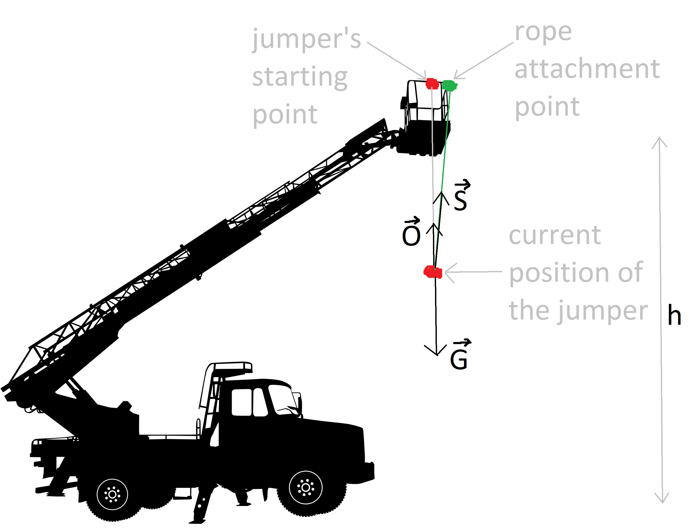
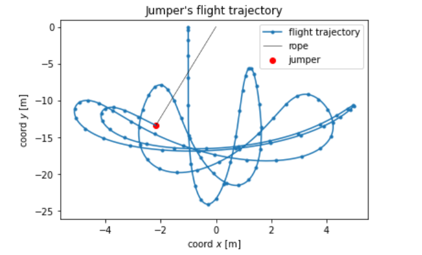
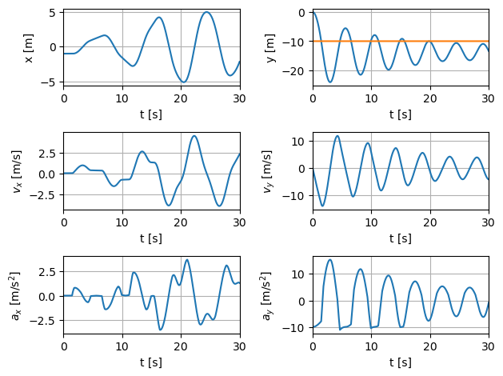
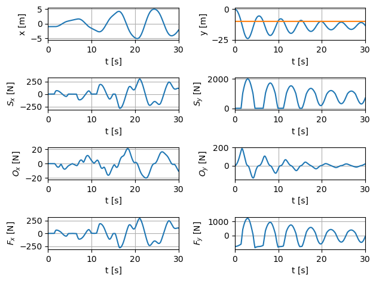

# Bungee Jumper Motion Parameters Calculator

This project aims to calculate the motion parameters of a bungee jumper using a program developed in Python. The program utilizes Jupyter Notebook for an interactive and exploratory coding environment. It also makes use of various libraries, including NumPy, Matplotlib, and ipywidgets.

## Features

- **Initial Position**: The program allows you to specify the initial position of the jumper using the Cartesian coordinates (x_s, y_s). The origin of the coordinate system is placed at the point where the rope is attached to the basket of the elevator.
- **Forces**: The simulation considers three main forces that act on the jumper during the entire motion:

    - **Gravity Force**: The force of gravity (vec{G}) affects the jumper and is calculated based on the mass m of the jumper.
    - **Elastic Force**: The elongation of the bungee rope generates an elastic force (vec{S}) acting on the jumper.
    - **Resistance Force**: The force of resistance to motion (vec{O}) is considered in the simulation.
- **Motion Parameters**: The program calculates various motion parameters of the bungee jumper throughout the simulation, including the position, velocity, acceleration, and energy.
- **Visualization**: The program provides visualizations of the bungee jumper's motion, including plots of position, velocity, and energy over time. Matplotlib is used to generate these visualizations.

- **Interactivity**: The program utilizes ipywidgets to enable interactive features, allowing you to explore the effect of different initial conditions and parameters on the motion of the bungee jumper.
## Results

At this stage I can visualize my solution by drawing the trajectory of the jumper.  

Below I have included some additional graphs showing the course of some physical quantities during the jump. 

The following graphs will show the waveforms of the x and y components of the elastic forces of the rope, the resistance to movement and the resultant force acting on the jumper.

Finally, I will draw graphs showing the time course of the y coordinate of the jumper, and the values of the various components of mechanical energy, i.e. his potential energy (gravity) and the elastic potential energy of the rope. In addition, I will also draw the time course of the value of the total mechanical energy of the jumper-rope system.

## Future Enhancements

The current version of the program provides a basic simulation of bungee jumper motion. However, there are several potential areas for future enhancements, such as:

- Adding more realistic physics models for the forces acting on the jumper.
- Incorporating wind effects and other external factors.
- Implementing advanced numerical integration methods for more accurate simulations.
- Including additional visualizations and analysis tools to further understand the jumper's motion.

## License

[MIT](https://choosealicense.com/licenses/mit/)

